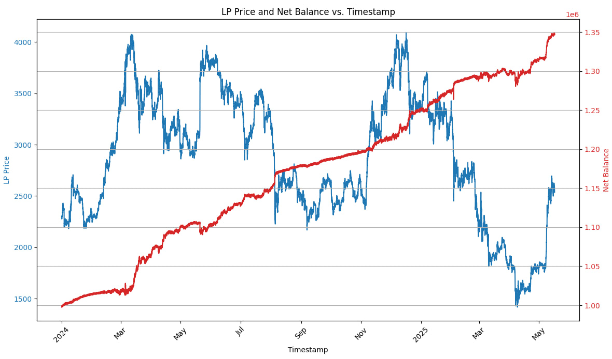
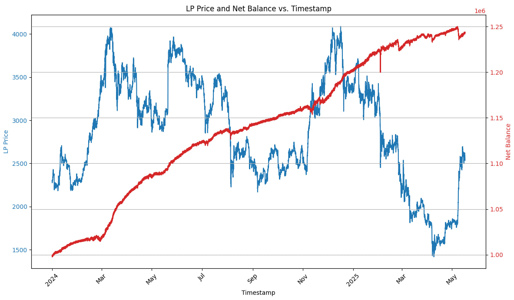
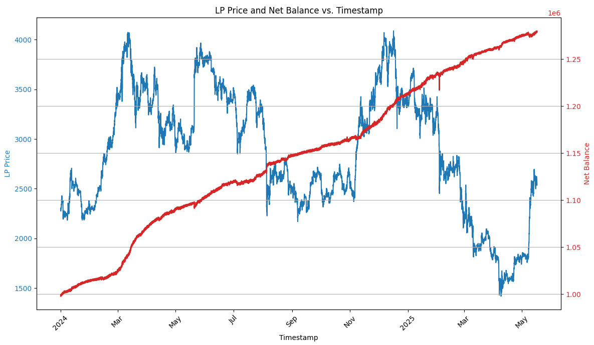
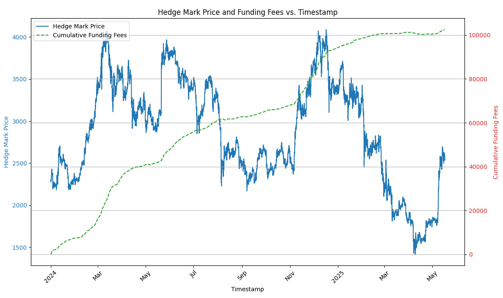

# Delta-Neutral Liquidity Provision on Uniswap V2 with Hyperliquid Hedge: A Backtesting Analysis

## 1. Introduction

Decentralized exchanges (DEXs) utilizing Automated Market Makers (AMMs), such as Uniswap V2, have become a cornerstone of Decentralized Finance (DeFi). Liquidity Providers (LPs) contribute assets to pools and earn trading fees in return. However, providing liquidity in volatile asset pairs (e.g., ETH/USDC) exposes LPs to Impermanent Loss (IL), which can offset or even outweigh the fees earned.

This report details a strategy designed to mitigate IL by combining liquidity provision on Uniswap V2 with a delta-neutral hedge using perpetual futures on Hyperliquid. The core idea is to maintain a short position in the volatile asset (ETH) to offset the ETH exposure held within the LP position. This approach aims to capture LP fees while minimizing directional price risk.

We formalize this strategy, prepare historical on-chain and off-chain data, and backtest its performance using the `fractal-defi` Python framework. The analysis quantifies key performance and risk metrics to evaluate the viability of this delta-neutral LP strategy.

## 2. Methodology

The strategy involves providing liquidity to a Uniswap V2 pool (specifically USDC/WETH 0.3% fee tier) and simultaneously hedging the ETH exposure by shorting ETH perpetual futures on Hyperliquid.

### 2.1 Core Strategy Algorithm

The strategy operates as follows:

1.  **Initialization:**
    *   An initial total notional capital is defined (`INITIAL_NOTIONAL`).
    *   This capital is allocated between the Uniswap V2 LP position and the margin for the Hyperliquid short position. The allocation considers the desired `HL_LEVERAGE` for the hedge.
        *   `initial_lp_deposit_notional = INITIAL_NOTIONAL / (1 + 1 / (2 * HL_LEVERAGE))`
        *   The LP deposit is split 50/50 between USDC and ETH by value.
    *   The initial ETH value in the LP (`initial_eth_value_in_lp = initial_lp_deposit_notional / 2`) determines the target size of the ETH short position.
    *   An initial short position is opened on Hyperliquid: `initial_eth_amount_to_short = initial_eth_value_in_lp / current_eth_price`.
    *   The required margin for this short is: `margin_for_initial_short = initial_eth_value_in_lp / HL_LEVERAGE`.
    *   Actions taken:
        *   Deposit `initial_lp_deposit_notional` into the Uniswap V2 LP entity.
        *   Open an LP position with this notional.
        *   Deposit `margin_for_initial_short` into the Hyperliquid HEDGE entity.
        *   Open a short position for `-initial_eth_amount_to_short` ETH.

2.  **Rebalancing the Hedge:**
    *   The strategy monitors the ETH amount held in the LP position (`lp_internal_state.token1_amount`) and the current size of the ETH short position on Hyperliquid (`hedge_entity.size`).
    *   A rebalance is triggered if the absolute difference between the LP's ETH holdings and the absolute size of the short position exceeds a predefined threshold relative to the LP's ETH holdings:
        `abs(lp_eth_amount - current_short_size_abs) / lp_eth_amount > REBALANCE_THRESHOLD_PCT`.
    *   **Rebalancing Action:**
        *   The target short position size is `-lp_eth_amount` (to fully hedge the ETH in the LP).
        *   The adjustment needed is `amount_to_adjust_product = desired_total_short_product - hedge_entity.size`.
        *   If `amount_to_adjust_product < 0` (increase short):
            *   The required margin for the additional short is calculated.
            *   If available margin on Hyperliquid is insufficient, a `ValueError` is raised (indicating a potential need for more capital or a risk of liquidation).
            *   Otherwise, the short position is increased.
        *   If `amount_to_adjust_product > 0` (decrease short):
            *   The short position is decreased.
    *   Rebalancing is skipped if the ETH price is invalid or the LP ETH amount is negligible. Adjustments with a notional value below a minimal threshold (e.g., $0.01) are also skipped.

3.  **State Monitoring:**
    *   The strategy includes a check to detect potential liquidation of the hedge position by verifying if the Hyperliquid account balance is zero while the LP still holds ETH.

### 2.2 Key Parameters

The strategy is governed by the following key parameters defined in `UniV2HLParams`:

*   `INITIAL_NOTIONAL` (float): The total initial capital in USD allocated to the strategy. (e.g., 1,000,000 USD)
*   `HL_LEVERAGE` (float): The leverage used for the short position on Hyperliquid. (e.g., 1.0x)
*   `REBALANCE_THRESHOLD_PCT` (float): The percentage deviation between the LP's ETH value and the short position's ETH value that triggers a rebalance. (e.g., 0.10, meaning 10%)

The Uniswap V2 pool configuration (`UniswapV2LPConfig`) is set for a USDC (6 decimals) / WETH (18 decimals) pool with a 0.3% fee rate.

### 2.3 Backtesting Framework

The strategy is implemented and backtested using the `fractal-defi` library.
*   **Entities:**
    *   `UniswapV2LPEntity`: Models the Uniswap V2 LP position.
    *   `HyperliquidEntity`: Models the Hyperliquid perpetual futures trading account for the hedge.
*   **Data Flow:** Historical data for ETH price, Hyperliquid funding rates, and Uniswap V2 pool states are transformed into a series of `Observation` objects. Each observation contains the global state for the LP (`UniswapV2LPGlobalState`) and the hedge (`HyperLiquidGlobalState`) at a given timestamp.
*   **Execution:** The `UniV2HyperLiquidHedge.run(observations)` method processes these observations sequentially, and the `predict()` method within the strategy class determines the actions (deposit, open_position, etc.) to take at each step based on the current state and defined logic.

## 3. Data Description

The backtest utilizes historical data from various sources to simulate market conditions.

### 3.1 Data Sources

*   **ETH Price:** Hourly ETH/USDT prices are sourced from Binance, loaded via `BinanceHourPriceLoader`. (Note: The script `univ2_hl_backtest.py` uses `BinanceHourPriceLoader`, because `HyperLiquidPerpsPricesLoader` lacked sufficient data).
*   **Funding Rates:** Hourly ETH funding rates from Hyperliquid are loaded via `HyperliquidFundingRatesLoader`.
*   **Uniswap V2 Pool Data:** Data for the USDC-ETH 0.3% pool (`POOL_ADDR = "0xB4e16d0168e52d35CaCD2c6185b44281Ec28C9Dc"`) including Total Value Locked (TVL), volume, fees, and liquidity, is fetched using TheGraph API via `EthereumUniswapV2PoolDataLoader`. An API key (`THEGRAPH_KEY`) is required for this.

### 3.2 Data Preparation and Time Span

*   **Time Span:** The backtest in `univ2_hl_backtest.py` is configured to run from `start = datetime(2024, 1, 1, tzinfo=UTC)` to `end = datetime(2025, 5, 17, tzinfo=UTC)`.
*   **Interval:** The data is processed at an hourly interval (`interval = "1h"`).
*   **Processing:**
    *   Data from the three sources (price, funding rates, pool data) are joined based on their timestamps.
    *   Uniswap V2 pool liquidity is converted to an integer with 18 decimals: `pool["liquidity"] = (pool["liquidity"] * 10**18).astype(int)`.
    *   Rows with any missing data after the join are dropped (`dropna()`).
    *   The combined data is then iterated to create a list of `Observation` objects, which serve as input for the strategy simulation.

## 4. Results

The performance of the delta-neutral LP strategy is evaluated based on the output of the `fractal-defi` backtest. The script `univ2_hl_backtest.py` saves the detailed strategy states and PnL to `result_univ2_hl_hedge.csv`.

The `result.get_default_metrics()` call in `univ2_hl_backtest.py` typically provides standard performance metrics. These should include:

*   Accumulated Return
*   Annualized Return (Annual Percentage Yield)
*   Sharpe Ratio
*   Maximum Drawdown

The current script configuration runs the backtest over a single period (January 1, 2024 - May 17, 2025).

### 4.1 UniV2HLParams(INITIAL_NOTIONAL=1_000_000, HL_LEVERAGE=1.0, REBALANCE_THRESHOLD_PCT=500) (no rebalance)

*   Accumulated Return: 0.3504
*   APY: 0.2548
*   Sharpe Ratio: 2.4001
*   Maximum Drawdown: -0.0177

### 4.2 UniV2HLParams(INITIAL_NOTIONAL=1_000_000, HL_LEVERAGE=1.0, REBALANCE_THRESHOLD_PCT=0.2)

*   Accumulated Return: 0.2467
*   APY: 0.1794
*   Sharpe Ratio: 1.9020
*   Maximum Drawdown: -0.0209

### 4.3 UniV2HLParams(INITIAL_NOTIONAL=1_000_000, HL_LEVERAGE=1.0, REBALANCE_THRESHOLD_PCT=0.1)

*   Accumulated Return: 0.2827
*   APY: 0.2056
*   Sharpe Ratio: 2.1780
*   Maximum Drawdown: -0.0158

### 4.4 Accumulation of funding fees

*Caption: Evolution of Cumulative Funding Fees accrued by the short perpetual position over the backtest period (January 1, 2024 - May 17, 2025).*

The preceding figure illustrates the relationship between the ETH mark price on the hedging venue and the cumulative funding fees received by the strategy's short perpetual position. A notable observation from this specific backtesting period is that the cumulative funding fees were positive, indicating a net income stream from holding the short perpetual contract. This outcome suggests that, under the observed market conditions, utilizing perpetual futures for hedging may offer a cost advantage compared to borrowing the underlying asset from a lending protocol, which typically incurs a borrowing interest rate.

However, it is crucial to emphasize that this positive funding fee scenario is specific to the conditions prevalent during this experiment. Funding rates are dynamic and can frequently turn negative (i.e., shorts pay longs), thereby imposing a cost on the hedge. Consequently, continuous monitoring and analysis of funding rate trends are imperative for assessing the ongoing viability and cost-effectiveness of using perpetual contracts for hedging in this strategy.

## 5. Discussion

This section discusses the strengths, weaknesses, risk drivers, and potential improvements for the implemented strategy.

### 5.1 Strengths

*   **Fee Generation:** The strategy aims to capture trading fees from Uniswap V2, which can be a significant source of yield.
*   **Impermanent Loss Mitigation:** The delta-neutral hedge is designed to reduce the impact of impermanent loss, a major risk for LPs.
*   **Utilizes Established Protocols:** Relies on well-known platforms like Uniswap V2 and Hyperliquid.
*   **Systematic Approach:** The rebalancing logic provides a systematic way to manage the hedge based on predefined parameters.

### 5.2 Weaknesses and Risks

*   **Funding Costs:** Maintaining a perpetual short position incurs funding costs, which can be positive (shorts pay longs) or negative (longs pay shorts). Consistently high positive funding rates can significantly erode profits.
*   **Liquidation Risk (Hedge):** The short position on Hyperliquid is subject to liquidation risk if the price of ETH rises significantly and the margin is insufficient, especially if leverage is high. The strategy script currently raises an error if margin is insufficient for rebalancing an *existing* position, but active management of margin levels to prevent liquidation under extreme moves is a crucial operational aspect.
*   **Slippage:** Rebalancing transactions (both for the LP and the hedge) can incur slippage, especially during volatile market conditions or in less liquid markets. This is not explicitly modeled in detail by the base entities in the provided scripts.
*   **Basis Risk:** The price of the perpetual future may not perfectly track the spot price of ETH, leading to discrepancies in hedge effectiveness.
*   **Gas Fees:** Transactions on Ethereum for Uniswap LP operations (deposit, withdraw) incur gas fees. These are not explicitly accounted for by the `UniswapV2LPEntity` in the provided `fractal-defi` setup and can impact the profitability of smaller positions or high-frequency rebalancing.
*   **Counterparty Risk:** Inherent risks associated with the smart contracts of Uniswap V2 and the Hyperliquid platform (e.g., bugs, exploits, platform downtime).
*   **Rebalancing Lag & Imperfection:** The rebalancing is periodic (based on data interval, effectively hourly in this setup) and threshold-based, meaning the hedge might not be perfectly delta-neutral between rebalances, leading to some residual IL or P&L variance.

### 5.3 Main Drivers of Risk/Return

*   **LP Fees vs. Funding Costs:** The primary profitability driver is whether the collected LP fees consistently exceed the net funding costs and other transaction costs (like gas and slippage).
*   **ETH Price Volatility:** High volatility increases potential impermanent loss (which the hedge aims to mitigate) but can also lead to more trading volume and thus higher fees earned by the LP. It also amplifies liquidation risk for the hedge.
*   **Hedge Effectiveness:** Depends on the `REBALANCE_THRESHOLD_PCT`, rebalancing frequency, leverage used, and actual execution slippage. A tighter threshold may lead to a better hedge but higher transaction costs.
*   **Leverage (`HL_LEVERAGE`):** Higher leverage on the short position reduces the capital required for margin but significantly increases the sensitivity to price moves and the risk of liquidation.
*   **Pool Utilization & Depth:** Higher trading volume in the Uniswap pool relative to its TVL generally leads to higher fees for LPs. The depth of the pool also impacts slippage for LP entries/exits.

### 5.4 Potential Improvements and Future Work

Based on the current implementation and the user's TODO list:

1.  **Enhanced Risk Management for Extreme Price Moves:**
    *   **Problem:** A significant price rise (e.g., approaching 100% gain with 1x leverage on the short, or less with higher leverage) can liquidate the short position, leaving the LP position unhedged.
    *   **Potential Solution:** Implement a "master stop-loss" or de-risking mechanism. If the ETH price rises towards a calculated critical level (e.g., X% below the estimated liquidation price of the short), the strategy could automatically:
        *   Close the entire short position.
        *   Withdraw all liquidity from the Uniswap V2 LP position.
        *   Pause operations and await manual review or a significant market retracement before redeploying.
    *   This is crucial for capital preservation.

2.  **Dynamic Capital Allocation Between LP and Hedge:**
    *   **Problem:** The current strategy defines initial capital allocation. Margin for the short is managed within its allocated portion. There isn't an automated flow of capital between the LP and HEDGE entities post-initialization.
    *   **Potential Solution:**
        *   **LP to Hedge:** If the HEDGE entity's margin falls below a critical maintenance level (but before liquidation), and it needs more collateral to safely maintain or increase the short, the strategy could be programmed to withdraw a portion of assets from the LP entity and transfer it to the HEDGE entity. This would require calculating the impact on the LP position and the overall delta.
        *   **Hedge to LP:** If the HEDGE entity accumulates significant excess margin (e.g., due to price movements favoring the short or accumulated funding), this excess capital (above a comfortable buffer + required margin) could potentially be withdrawn and redeployed into the LP position to enhance capital efficiency.
    *   **Considerations:** This adds significant complexity, involving logic for partial LP withdrawals/deposits (and associated gas/slippage costs) and continuous monitoring of both entities' capital health.

3.  **Optimized Rebalancing Threshold & Frequency:** The `REBALANCE_THRESHOLD_PCT` and the rebalancing check frequency (currently tied to the hourly data interval) could be optimized. A dynamic threshold based on market volatility or a cost-benefit analysis (transaction costs vs. hedge deviation) might be more effective.

4.  **Funding Rate Awareness:** The strategy could incorporate logic to react to extreme funding rates. For example, if funding costs for shorts become prohibitively high for an extended period, it might temporarily reduce the hedge size or even pause the strategy.

5.  **Leverage Management Strategy:** Instead of a fixed `HL_LEVERAGE`, consider a dynamic leverage approach. For instance, lower leverage during high volatility or when the hedge is significantly in profit, and potentially higher (with caution) in more stable, range-bound markets.

6.  **Explicit Transaction Cost Modeling:** For more realistic backtesting, integrate estimations for gas fees for LP operations on Ethereum and trading fees/slippage for both LP adjustments and hedge rebalancing on Hyperliquid. Some `fractal-defi` entities might allow for fee parameterization.

7.  **Broader Asset & Pool Testing:** Expand the analysis to other Uniswap V2 pools (e.g., different blue-chip pairs, stablecoin pairs if applicable to variations of the strategy) or even different AMM protocols and hedging venues to assess the robustness and adaptability of the core concept.

8.  **Sophisticated Position Sizing:** The initial position sizing and rebalancing increments could be based on more sophisticated risk models, such as target volatility or Value at Risk (VaR) for the overall strategy.

## 6. Conclusion

The delta-neutral liquidity provision strategy on Uniswap V2, hedged with Hyperliquid perpetual futures, presents a structured approach to earning LP fees while attempting to mitigate impermanent loss. The success of such a strategy is highly dependent on the interplay between collected LP fees, hedge funding costs, transaction costs, and the effectiveness of the rebalancing mechanism in maintaining delta neutrality. The outlined backtesting framework in `univ2_hl_backtest.py` and `strategies/univ2_hl_hedge.py` provides a starting point for evaluating its historical performance.

Further rigorous testing across diverse market conditions, incorporation of realistic transaction costs, and development of the suggested improvements—particularly around dynamic risk management and capital allocation—are essential steps before considering live deployment.